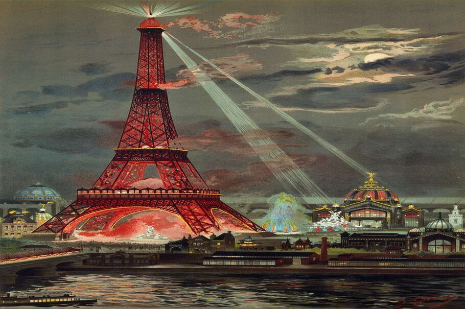
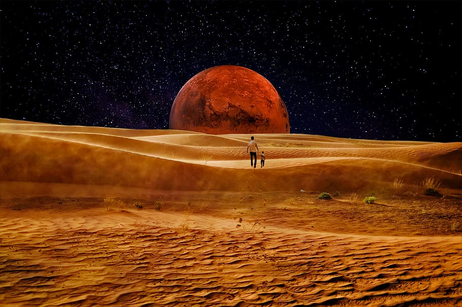
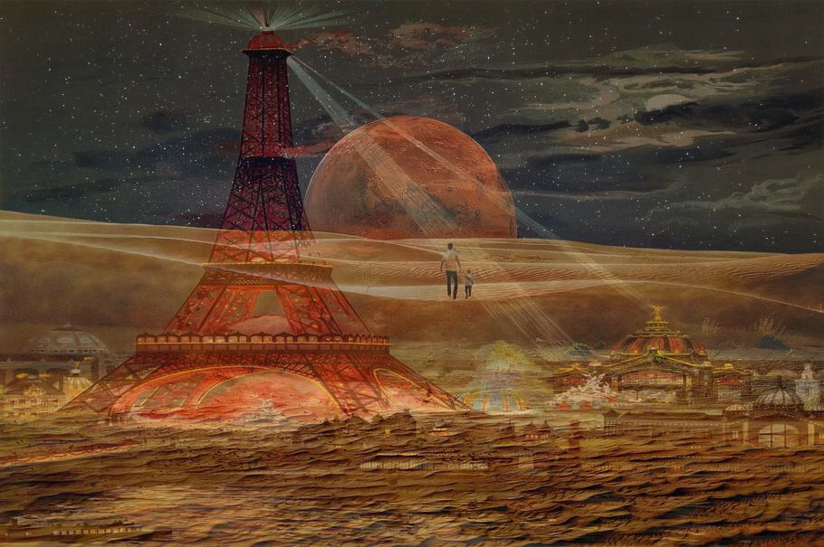

<h2 align=center> DeepDream-Creative-AI </h2>

[This project is also available on Kaggle](https://www.kaggle.com/anantgupt/starter-creative-ai-deepdream)

Deep Dream is a computer vision program created by Google. Uses a convolutional neural network to find and enhance patterns in images with powerful AI algorithms. Creating a dreamlike hallucinogenic appearance in the deliberately over-processed images.

When you look for shapes in the clouds, you’ll often find things you see every day: Dogs, people, cars. It turns out that artificial “brains” do the same thing. Google calls this phenomenon “Inceptionism,” and it’s a shocking look into how advanced artificial neural networks really are. ON trained upon, each CNN layer learns filters of increasing complexity. The first layers learn basic feature detection filters such as edges and corners. The middle layers learn filters that detect parts of objects — for faces, they might learn to respond to eyes and noses. The last layers have higher representations: they learn to recognize full objects, in different shapes and positions.

- If we feed an image to CNN model it it starts detecting various featue in a image, the initial layers will detect low-level features like edges and shape
- AS deepper as we go high level features will be detected like color, face , tree, buliding...
- It is expermented that is a network is trained over say dog then it try to detect a dog in the image, or a plant or any face.
- From here the idea of deep dream rises that what is we try to magnify what the network is detecting.
- When we feed an image in to CNN, the neurons will fire up generate results, we call them activations
- The deep dream algorithm works in the way that it will try to change the input image by making soome of these neurons fire more
- We can select layers that we want to keep in the network & bhy the combination of different layers, intersting patterns will drawn in image
- For Ex. if input a image of water to network which is trained on fish images, then network will to identify fishes in the image and will generate output of we magnify these activations. More patterns will apper in image.

**The final few layers assemble those into complete interpretations—these neurons activate in response to very complex things such as entire buildings or trees,” Google’s engineers explain.**

Normally when an image is feed to network depending on the problem we select a loss function and try to minimize it which is called gradient decend and feed the image again, but in deep dream we try to maximize this loss (gradient ascend). Instead of changing model weights we are changinf the input

**DEEP DREAM STEPS**

* First we train a deep netwok
* We select the layers we want ot keep in network
* Calculate the activations coming from them
* Calculte the gradient and loss of these activations
* Modify the input image by incresing these activation, thus enhancing the pattern
* Feed the obtained image to network again
* This process is repeated number of times

SOME BEAUTIFUL WORKS OF DEEP DREAM
------

  
  

Dependencies
------

Python 3.8 , Pandas, Tensorflow 2.2, Keras, Matplotlib, Seaborn ,Numpy, PIL, opencv

IMPLEMENTATION
------

In this project I have used **inception net and dense  net** to implement deepdream algorithm on two images belended togeather

  
  

**Blended image: (0.5)**

Results
----

I have putted the results of dense net and incetion net in the video folder you can download to view it.

Refrences
----

- https://www3.cs.stonybrook.edu/~cse352/T12talk.pdf
- https://www.topbots.com/advanced-topics-deep-convolutional-neural-networks/
- https://wccftech.com/nvidia-demo-skynet-gtc-2014-neural-net-based-machine-learning-intelligence/
- https://gizmodo.com/these-are-the-incredible-day-dreams-of-artificial-neura-1712226908
- https://ai.googleblog.com/2015/06/inceptionism-going-deeper-into-neural.html
- SuperDataScience

**Drop a Star if you liked it**
